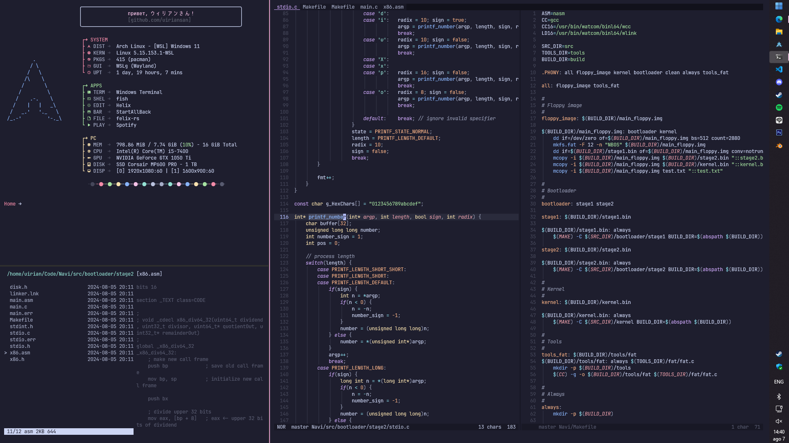

**Host OS:**         Windows 11\
**WSL Distro:**      [Arch Linux](https://www.microsoft.com/store/productId/9MZNMNKSM73X?ocid=pdpshare)\
**Terminal:**        [Windows Terminal](https://github.com/microsoft/terminal)\
**Shell:**           [Fish](https://github.com/fish-shell/fish-shell) + [Starship](https://github.com/starship/starship)\
**Fetch:**           [Fastfetch](https://github.com/fastfetch-cli/fastfetch)\
**Editor:**          [Helix](https://github.com/helix-editor/helix)\
**File manager:**    [Felix](https://github.com/kyoheiu/felix) and [Yazi](https://github.com/sxyazi/yazi)\
**Browser:**         [w3m](https://wiki.archlinux.org/title/W3m)\
**Windows taskbar:** [StartAllBack](https://www.startallback.com/)\
**Themes:**          Catppuccin, Tokyonight and Everforest\
**Font:**            [JetBrainsMono Nerd Font Mono](https://www.nerdfonts.com/font-downloads)

-----

- In order to keep `pkglist.txt` up to date, copy `savepkgs.hook` to `/usr/share/libalpm/hooks/`
- To install the packages listed in `pkglist.txt`, run `pacman -S --needed $(comm -12 <(pacman -Slq | sort) <(sort pkglist.txt))`
